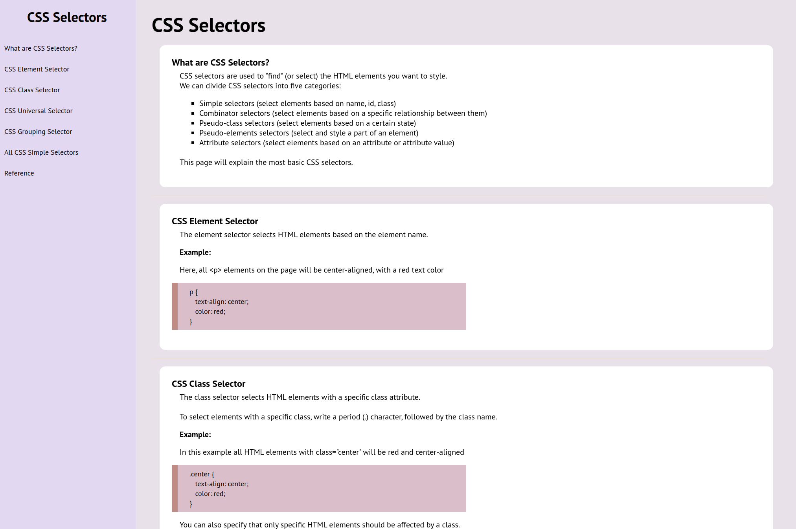

# Technical Documentation Page- FreeCodeCamp

## About The Project
This technical documentation page was built as part of the Responsive Web Design Certification through the Free Code Camp curriculum. To complete the project, coders are given an example documentation page and are asked to replicate it to the best of their ability, while styling the page to their liking. I chose to use CSS documentation and gathered the information from W3 Schools.

### Built With
* HTML
* CSS

## Acknowledgements
* [W3 Schools](https://www.w3schools.com/)
* [Font Awesome](https://fontawesome.com/)
* [Google Fonts](https://fonts.google.com/)